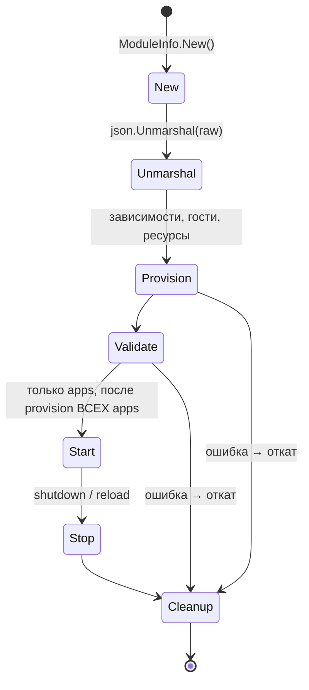
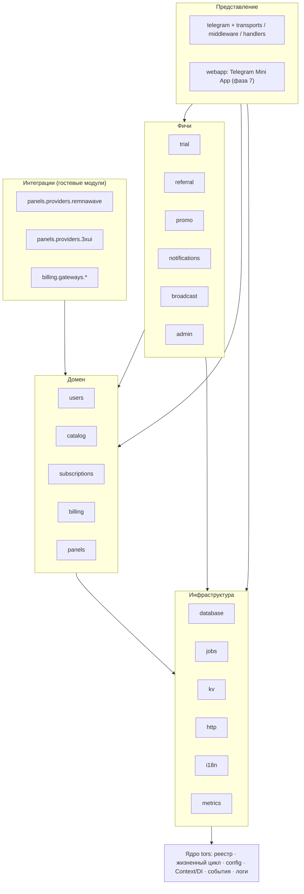
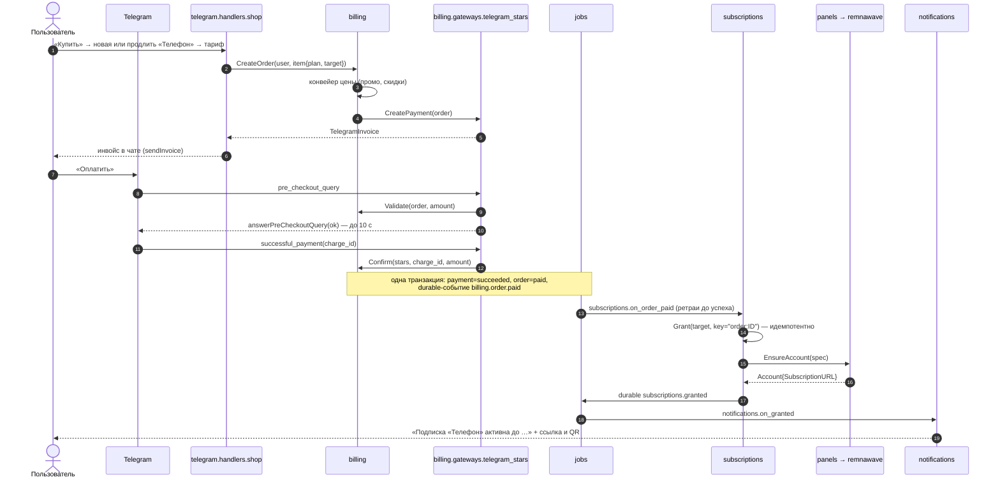

# TORS — план архитектуры модульного бота продажи подписок

> Telegram-бот для продажи VPN-подписок. Первая панель — **Remnawave**, следующая — **3x-UI**.
> Язык — **Go**. Архитектура — «микроядро + модули» по образцу **Caddy v2**.

---

## 0. Кратко

- **Ядро** (`package tors`, корень репозитория) ничего не знает ни о Telegram, ни о VPN, ни о деньгах.
  Оно умеет только: регистрировать модули, загружать их из конфига, управлять их жизненным циклом,
  связывать их друг с другом (DI через `Context`) и передавать события. Зависимости ядра — только stdlib.
- **Всё остальное — модули**, которые регистрируются в `init()` и подключаются импортом при сборке (как в Caddy/xcaddy):
  Telegram, база данных, очередь задач, панели (Remnawave, 3x-UI), платёжные шлюзы, тарифы, подписки,
  триал, рефералка, промокоды, рассылки, админка.
- Модули делятся на **приложения** (apps, верхний уровень: `telegram`, `panels`, `billing`, …) и
  **гостевые модули** в пространствах имён своих хостов (`panels.providers.remnawave`, `billing.gateways.telegram_stars`,
  `telegram.handlers.shop`, …).
- Панели скрыты за контрактом `panels.Provider` с **декларативным идемпотентным** `EnsureAccount(spec)` и
  **опциональными возможностями** (capability-интерфейсы). Remnawave и 3x-UI — два гостевых модуля одного хоста.
- Бизнес-поток «оплата → выдача подписки» надёжен: подтверждение платежа и постановка события в очередь
  происходят в одной транзакции (transactional outbox), обработчики идемпотентны.
- MVP = фазы 0–5 (ядро → инфраструктура → Telegram → домен + Remnawave → биллинг). Mini App — фаза 7,
  3x-UI — фаза 8; обе не требуют изменений ни в ядре, ни в домене.
- **Принятые решения** (§20): оплата — только Telegram Stars; у пользователя может быть несколько подписок;
  внутренний баланс и админка — необязательные модули; тарифы — в конфиге; языки — ru (по умолчанию) и en;
  импорт пользователей из панели не нужен; Mini App планируется; запускается одна копия бота.
- **Стек** (§21, версии сверены на 28.09.2026): Go 1.27, PostgreSQL 18, pgx + sqlc + goose, River, telego (Bot API 10.3),
  OpenTelemetry; Mini App — TypeScript + React + Vite + tma.js. **Границы расширяемости** — §22.

---

## 1. Цели и не-цели

**Цели**

1. Ядро — «максимальный полезный минимум»: стабильный, маленький, покрытый тестами, редко меняющийся.
2. Любая функция бота включается/выключается конфигом, заменяется или дописывается сторонним модулем без правки ядра.
3. Новая панель (3x-UI, позже — Marzban и др.) = новый гостевой модуль, без изменений домена и UI.
4. Новый платёжный шлюз = новый гостевой модуль.
5. Надёжность денег: ни одна оплата не теряется и не засчитывается дважды.
6. Telegram Mini App (запланирован) — вторая «витрина» над тем же доменом; домен не зависит от чата Telegram.

**Не-цели (на старте)**

- Динамическая загрузка плагинов в рантайме (`plugin`, go-plugin) — см. ADR-001.
- Мультитенантность (несколько независимых магазинов в одном процессе).
- Горизонтальное масштабирование: работает одна копия процесса. Архитектура не мешает запустить несколько копий позже.
- Импорт существующих пользователей из панели.
- Платёжные шлюзы, кроме Telegram Stars (добавляются потом отдельными модулями без изменения домена).
- Собственный DSL конфигурации (аналог Caddyfile) — достаточно JSON + YAML-адаптера.

---

## 2. Что берём у Caddy и что адаптируем

| Caddy v2 | TORS | Комментарий |
|---|---|---|
| `caddy.RegisterModule(m)` в `init()` | `tors.RegisterModule(m)` в `init()` | Компиляционная модульность |
| `CaddyModule() ModuleInfo{ID, New}` | `TorsModule() ModuleInfo{ID, New}` | |
| ID с пространствами имён: `http.handlers.file_server` | `panels.providers.remnawave`, `billing.gateways.stars` | Namespace = «гнездо» хоста |
| `Provisioner` / `Validator` / `CleanerUpper` | те же | Опциональные интерфейсы жизненного цикла |
| `caddy.App` (`Start/Stop`) | `tors.App` (`Start/Stop`) | Модули верхнего уровня |
| `ctx.LoadModule(s, "Field")` + тег `caddy:"namespace=… inline_key=…"` | `ctx.LoadModule(s, "Field")` + тег `tors:"namespace=… inline_key=…"` | Хост грузит гостей из своего JSON |
| `ctx.App("tls")` — ленивая загрузка и связывание | `ctx.App("panels")` + `tors.AppAs[panels.Service](ctx, "panels")` | + generics; зависимость от интерфейса, а не от типа — модуль можно заменить |
| Нативный JSON + адаптеры (Caddyfile) | Нативный JSON + адаптер YAML | |
| `{env.X}` плейсхолдеры | `{env.X}`, `{file./path}` | Секреты не в конфиге |
| xcaddy (кастомные сборки) | свой `main.go` с импортами → позже `xtors` | |
| Admin API `/load`, атомарная перезагрузка с откатом | `SIGHUP` / `tors reload` (фаза 9) | Жизненный цикл проектируется под reload сразу |
| `caddyevents` — отдельное приложение | **Шина событий в ядре** + гарантированная доставка в модуле `jobs` | В боте события — основной способ интеграции фич, поэтому шина входит в «полезный минимум» (≈200 строк, только stdlib) |

---

## 3. Ядро

### 3.1. Состав ядра

| Компонент | Файл | Зачем в ядре |
|---|---|---|
| Реестр модулей | `modules.go` | Без него нет модульности |
| Жизненный цикл | `lifecycle.go`, `tors.go` | Единый порядок New → Unmarshal → Provision → Validate → Start → Stop → Cleanup, откат при ошибке |
| Context / DI | `context.go` | Загрузка гостевых модулей, получение других приложений, логгер модуля |
| Конфигурация | `config.go`, `adapters.go`, `replacer.go` | Формат, адаптеры, плейсхолдеры `{env.*}`, общие типы `Duration("30d")`, `Size("100GiB")` |
| Шина событий | `events.go` | Слабая связанность модулей (in-memory, синхронная) |
| Логирование | `logging.go` | `log/slog`, логгер с полем `module=<id>` |
| CLI-каркас | `cmd/` | `run`, `validate`, `adapt`, `list-modules`, `version` + регистрация команд модулями |

**Чего в ядре нет** (и не будет): Telegram, БД, KV, HTTP-сервер, очередь задач, i18n, деньги, пользователи,
панели, тарифы, планировщик. Всё это — модули. Проверка в CI: `go list -deps .` для корневого пакета
не должен содержать ничего, кроме stdlib.

### 3.2. Модель модуля

```go
// modules.go
type ModuleID string // "panels.providers.remnawave"

func (id ModuleID) Namespace() string // "panels.providers"
func (id ModuleID) Name() string      // "remnawave"

type ModuleInfo struct {
	ID  ModuleID
	New func() Module // новый пустой экземпляр; без побочных эффектов
}

type Module interface {
	TorsModule() ModuleInfo
}

func RegisterModule(m Module)                  // из init(); паника при дубликате/невалидном ID
func GetModule(id string) (ModuleInfo, error)
func GetModules(namespace string) []ModuleInfo // для list-modules и сообщений об ошибках
```

```go
// lifecycle.go — все интерфейсы опциональны
type Provisioner  interface{ Provision(Context) error } // зависимости, ресурсы, загрузка гостей
type Validator    interface{ Validate() error }         // только проверки, без побочных эффектов
type CleanerUpper interface{ Cleanup() error }          // освободить то, что взято в Provision

// App — модуль верхнего уровня (пустой namespace): telegram, panels, billing…
type App interface {
	Module
	Start() error // запуск фоновой активности; не блокирует
	Stop() error  // остановка; идемпотентна
}

// HealthChecker — опционально; агрегируется в /readyz модулем http.
type HealthChecker interface{ Health(context.Context) error }
```

**Пространства имён** (namespace = хост, который грузит такие модули):

| Namespace | Хост | Примеры |
|---|---|---|
| `""` (apps) | ядро | `database`, `jobs`, `kv`, `http`, `i18n`, `users`, `catalog`, `panels`, `billing`, `subscriptions`, `telegram`, `trial`, `referral`, … |
| `config.adapters` | ядро | `yaml` |
| `kv.stores` | `kv` | `memory`, `postgres` (позже при необходимости — `redis`) |
| `catalog.sources` | `catalog` | `config`, `db` |
| `panels.providers` | `panels` | `remnawave`, `3xui`, `fake` |
| `billing.gateways` | `billing` | `telegram_stars`, `balance` (из модуля `wallet`), `fake`; позже — любые другие |
| `billing.pricing` | `billing` | `promo`, `referral_discount` |
| `telegram.transports` | `telegram` | `polling`, `webhook` |
| `telegram.middleware` | `telegram` | `recover`, `logging`, `ratelimit`, `users`, `i18n`, `ban`, `require_channel` |
| `telegram.handlers` | `telegram` | `start`, `main_menu`, `shop`, `my_subscriptions`, `trial`, `referral`, `promo`, `wallet`, `support`, `language`, `admin` |
| `webapp.endpoints` | `webapp` | API и экраны Mini App: `shop`, `subscriptions`, `referral`, `wallet`, … |

> Имя пакета Go не может начинаться с цифры, поэтому модуль `panels.providers.3xui` живёт в пакете `xui`.

### 3.3. Жизненный цикл



`tors.Run(cfg)`:

1. Адаптировать конфиг в JSON (если не JSON), подставить `{env.*}`/`{file.*}`.
2. Создать корневой `Context`.
3. Для каждого приложения из `apps` вызвать `ctx.App(name)`: `New` → `Unmarshal` → `Provision` → `Validate`.
   Внутри `Provision` модуль может запросить другие приложения (`ctx.App`) — они провижинятся лениво,
   циклы детектируются и дают понятную ошибку. **Порядок завершения Provision = топологический порядок зависимостей.**
4. Любая ошибка → `Cleanup` всего, что уже провижинено, в обратном порядке; процесс (или старая конфигурация при reload) не затронут.
5. `Start()` всех приложений в топологическом порядке; ошибка → `Stop` уже запущенных + `Cleanup`.
6. Остановка: `Stop()` в обратном порядке, отмена `Context` → `Cleanup`.

**Контракт для авторов модулей:** после `Provision` модуль обязан быть готов обслуживать вызовы
(другие модули могут звать его методы, HTTP-маршруты уже смонтированы). `Start` — только запуск фоновых
процессов (поллинг, воркеры, cron). Никаких глобальных переменных состояния — иначе не будет hot reload.

**Hot reload (фаза 9):** новая конфигурация провижинится целиком параллельно со старой; при успехе
старая останавливается, новая стартует; при ошибке — новая откатывается, старая продолжает работать.
Для дорогих разделяемых ресурсов (пул БД) — `tors.UsagePool` по аналогии с Caddy.

### 3.4. Context и загрузка модулей

```go
type Context struct {
	context.Context
	// скрыто: текущий конфиг, стек загружаемых модулей, cleanup-функции
}

func (ctx Context) LoadModule(structPtr any, field string) (any, error)
func (ctx Context) LoadModuleByID(id string, raw jsontext.Value) (any, error)
func (ctx Context) App(name string) (any, error)             // ленивый Provision + детект циклов
func (ctx Context) AppIfConfigured(name string) (any, error) // (nil, nil), если приложения нет в конфиге
func (ctx Context) Logger() *slog.Logger                      // уже с полем module=<id>
func (ctx Context) Events() *Events
func (ctx Context) OnCancel(f func())

func AppAs[T any](ctx Context, name string) (T, error)       // типобезопасная обёртка; T — интерфейс-контракт (panels.Service)
```

Хост описывает поле с гостями тегом, ядро по типу поля выбирает форму загрузки:

| Тип поля | Смысл | JSON |
|---|---|---|
| `jsontext.Value` + `inline_key` | один модуль | `"transport": {"transport": "polling"}` |
| `[]jsontext.Value` + `inline_key` | упорядоченный список | `"middleware": [{"middleware": "recover"}, …]` |
| `map[string]jsontext.Value` + `inline_key` | именованные экземпляры | `"providers": {"rw-main": {"provider": "remnawave", …}}` |
| `tors.ModuleMap` (без `inline_key`) | ключ = имя модуля | `"apps": {"telegram": {…}}` |

```go
type App struct {
	ProvidersRaw map[string]jsontext.Value `json:"providers" tors:"namespace=panels.providers inline_key=provider"`
	providers    map[string]Provider
}

func (a *App) Provision(ctx tors.Context) error {
	mods, err := ctx.LoadModule(a, "ProvidersRaw") // map[string]any
	if err != nil {
		return err
	}
	for name, m := range mods.(map[string]any) {
		a.providers[name] = m.(Provider)
	}
	return nil
}
```

### 3.5. Конфигурация

- **Нативный формат — JSON** (строгий, его и разбирают модули). Разбор — `encoding/json/v2` из stdlib
  (в Go 1.27 включён по умолчанию): неизвестное поле в конфиге — ошибка старта, а не молчаливо проигнорированная опечатка;
  «сырой» JSON гостевых модулей — `jsontext.Value`. Человекочитаемый формат — **YAML через адаптер**
  (`config.adapters.yaml`, отдельный модуль). `tors adapt` показывает итоговый JSON.
- **Плейсхолдеры** `{env.BOT_TOKEN}`, `{file./run/secrets/rw_token}` подставляются ядром в строковые значения
  до разбора — секреты не хранятся в конфиге.
- **Общие типы** в ядре: `tors.Duration` (понимает `30d`, `12h`), `tors.Size` (`100GiB`).
- **JSON Schema**: каждый модуль описывает схему своего конфига (генерируется из структуры); `tors schema`
  собирает общую схему — редактор подсказывает поля и ловит ошибки в YAML ещё до запуска.
- **Разделение**: статический конфиг (инфраструктура, токены, какие модули включены, тарифы на старте) —
  файл; оперативные данные (пользователи, заказы, промокоды, позже — тарифы из админки) — БД модулей.

Верхний уровень:

```json
{
  "logging": { "level": "info", "format": "json" },
  "apps": { "database": {…}, "telegram": {…}, "panels": {…}, … }
}
```

### 3.6. Шина событий

```go
type Event interface{ EventName() string } // "billing.order.paid"

func On[E Event](bus *Events, h func(context.Context, E) error) (off func())
func (b *Events) OnPattern(pattern string, h func(context.Context, Envelope) error) (off func()) // "billing.*"
func Emit(ctx context.Context, bus *Events, e Event) error
```

- Синхронная in-memory доставка в порядке подписки; паника обработчика перехватывается; ошибка логируется.
- Обработчик может вернуть `tors.ErrAbort` — `Emit` вернёт её эмиттеру (для «before»-событий, например антифрод).
- **Событие — это факт, который уже произошёл.** Шина ядра не гарантирует доставку. Гарантированная
  доставка (at-least-once, ретраи, переживает рестарт) — в модуле `jobs` (см. §6.2), тот же типизированный API.

### 3.7. CLI

`tors run | validate | adapt | schema | list-modules [--namespace …] | version | reload (фаза 9)`.
Модули могут регистрировать свои подкоманды (`cmd.RegisterCommand`): `tors db migrate`,
`tors panels ping`, `tors catalog check` (проверить тарифы и их размещение на панелях).
`tors version` печатает версии всех вкомпилированных модулей из `debug.ReadBuildInfo`.

---

## 4. Карта модулей

### 4.1. Слои



### 4.2. Модули

| Модуль (ID) | Слой | Назначение |
|---|---|---|
| `database` | инфра | Пул pgx, транзакция в `context`, миграции по модулям |
| `jobs` | инфра | Очередь задач на Postgres (River): ретраи, cron, durable-события |
| `kv` + `kv.stores.*` | инфра | Хранилище «ключ → значение» для короткоживущих данных: шаг диалога, лимиты, токены кнопок (см. §6.3) |
| `http` | инфра | Общий HTTP-сервер: вебхуки Telegram и панелей, Mini App, `/healthz`, `/readyz`, `/metrics` |
| `i18n` | инфра | Переводы, переопределение текстов из конфига/каталога |
| `metrics` | инфра | Метрики и трейсы на OpenTelemetry, `/metrics` для Prometheus |
| `users` | домен | Пользователи и их идентичности (telegram, позже web), язык, блокировки |
| `catalog` + `catalog.sources.*` | домен | Тарифы (из конфига, позже из БД) |
| `panels` + `panels.providers.*` | домен | Контракт панелей, реестр экземпляров, нормализованные события, опрос |
| `billing` + `billing.gateways.*` + `billing.pricing.*` | домен | Заказы, платежи, подтверждение, конвейер цены |
| `subscriptions` | домен | Подписки (несколько на пользователя), `Grant`/продление, сверка с панелью, напоминания |
| `trial`, `referral`, `promo` | фичи | Каждая — домен + опциональный UI-модуль `telegram.handlers.*` (позже и `webapp.endpoints.*`) |
| `wallet` | фичи (опц.) | Внутренний баланс в Stars; даёт шлюз `billing.gateways.balance` |
| `notifications`, `broadcast` | фичи | Уведомления по событиям, рассылки с учётом лимитов Telegram |
| `admin` | фичи/UI (опц.) | Админ-меню в боте; другие модули добавляют в него свои экраны |
| `telegram` + гости | UI | Транспорт, роутер, middleware, меню, сцены, отправка |
| `webapp` + гости | UI | (фаза 7) Telegram Mini App: JSON API + статика, авторизация по `initData` |
| `subaggregator` | фичи | (фаза 8) Единая ссылка подписки для тарифа на нескольких панелях |

### 4.3. Три способа взаимодействия модулей

| Способ | Когда | Пример |
|---|---|---|
| **Сервис приложения** — `tors.AppAs[billing.Service](ctx, "billing")` и вызов метода | Нужен ответ/результат прямо сейчас, связь «использует» | `shop` вызывает `billing.CreateOrder` |
| **Гостевой модуль** — хост грузит из своего конфига | Точка расширения с порядком/конфигом, выбираемая пользователем | `billing.pricing.promo`, `telegram.middleware.ratelimit` |
| **Событие** — `Emit` / durable через `jobs` | Реакция на факт, эмиттер не должен знать о подписчиках | `billing.order.paid` → `subscriptions`, `referral`, `notifications` |

### 4.4. Правила зависимостей (проверяются в CI через `depguard`/`go-arch-lint`)

1. Ядро → только stdlib. Никогда не импортирует `modules/…`.
2. `pkg/…` — чистые библиотеки (деньги, ретраи, форматирование); не импортируют ядро и модули.
3. **Хост никогда не импортирует своих гостей** (как в Caddy): `panels` не знает про `remnawave`.
4. Доменные модули не импортируют `telegram` и конкретные провайдеры/шлюзы.
5. Гость импортирует пакет своего хоста (контракт) + свой SDK; с остальным — через `Context` и события.
6. UI-модули (`telegram.handlers.*`) импортируют домен; домен про UI не знает.
7. Межмодульные внешние ключи в БД — только на `users`; прочие ссылки — ID без FK.
8. Зависимость от другого приложения — только через его интерфейс-контракт (`billing.Service`), не через конкретный тип:
   тогда любой стандартный модуль можно заменить своей реализацией (§22).

---

## 5. Структура репозитория

```
tors/
├── go.mod                       # module github.com/tori43-hash/tors  (go 1.27)
├── tors.go                      # Run / Stop / Reload
├── modules.go                   # ModuleID, ModuleInfo, реестр
├── lifecycle.go                 # Provisioner, Validator, CleanerUpper, App, HealthChecker
├── context.go                   # Context, LoadModule, App, AppAs[T]
├── config.go                    # Config, ModuleMap, Duration, Size
├── adapters.go                  # ConfigAdapter + реестр (JSON встроен)
├── replacer.go                  # {env.X}, {file.path}
├── events.go                    # шина событий
├── logging.go                   # slog
├── internal/                    # приватные хелперы ядра
├── cmd/
│   ├── main.go                  # torscmd.Main(), команды, RegisterCommand
│   └── tors/main.go             # стандартный дистрибутив
├── pkg/
│   ├── money/                   # Money{Amount int64 (минорные единицы), Currency}
│   ├── retry/
│   └── tgtext/                  # экранирование, шаблоны HTML для Telegram
├── modules/
│   ├── standard/imports.go      # стандартный набор модулей
│   ├── yamladapter/             # config.adapters.yaml
│   ├── database/                # app: database
│   ├── jobs/                    # app: jobs
│   ├── kv/                      # app: kv  + memory/ postgres/
│   ├── httpserver/              # app: http
│   ├── i18n/                    # app: i18n
│   ├── metrics/                 # app: metrics
│   ├── users/                   # app: users
│   ├── catalog/                 # app: catalog + configsource/ dbsource/
│   ├── panels/                  # app: panels (контракт, watcher, события)
│   │   ├── panelstest/          # общий контрактный тест-сьют провайдеров
│   │   ├── remnawave/           # panels.providers.remnawave
│   │   ├── xui/                 # panels.providers.3xui
│   │   └── fake/                # panels.providers.fake (dev/тесты)
│   ├── billing/                 # app: billing
│   │   ├── billingtest/         # контрактный тест-сьют шлюзов
│   │   ├── stars/ fake/         # billing.gateways.telegram_stars, .fake
│   ├── subscriptions/           # app: subscriptions
│   │   └── tgui/                # telegram.handlers.my_subscriptions
│   ├── telegram/                # app: telegram (роутер, меню, сцены, отправка)
│   │   ├── polling/ webhook/    # telegram.transports.*
│   │   ├── mw/                  # telegram.middleware.*
│   │   └── start/ mainmenu/ language/ support/
│   ├── shop/                    # telegram.handlers.shop (витрина: catalog + billing)
│   ├── trial/      (+ tgui/)
│   ├── referral/   (+ tgui/)    # + billing.pricing.referral_discount
│   ├── promo/      (+ tgui/)    # + billing.pricing.promo
│   ├── wallet/     (+ tgui/)    # внутренний баланс (опц.) + billing.gateways.balance
│   ├── notifications/
│   ├── broadcast/  (+ tgui/)
│   ├── admin/                   # telegram.handlers.admin (опц.)
│   ├── webapp/                  # app: webapp — Mini App (фаза 7)
│   └── subaggregator/           # фаза 8
├── configs/examples/            # minimal.yaml, remnawave.yaml, full.yaml
├── deploy/                      # Dockerfile (distroless), docker-compose.yml
└── docs/
    ├── PLAN.md
    ├── adr/
    └── modules.md               # как писать модули
```

**Фича = один каталог**: доменная часть (приложение) + `tgui/` с UI-модулем бота. Включаются в конфиге независимо —
в фазе 7 рядом появится `webui/` для Mini App, а домен фичи не изменится.

---

## 6. Инфраструктурные модули

### 6.1. `database`
- PostgreSQL через `pgx/v5`; запросы — `sqlc` (на модуль свои `queries/`).
- Транзакция передаётся через `context`: `db.InTx(ctx, func(ctx context.Context) error {…})` — позволяет
  нескольким модулям участвовать в одной транзакции (billing + jobs).
- **Миграции по модулям**: каждый модуль встраивает `migrations/*.sql` через `embed.FS` и в своём `Provision`
  вызывает `db.Migrate(ctx, "billing", fs)`; `goose` (Provider API) с отдельной таблицей версий на модуль.
  Порядок гарантируется зависимостями: модуль сначала берёт `ctx.App("users")`, потом мигрирует.
- Таблицы модуля — с префиксом: `billing_orders`, `subscriptions_bindings`, …

### 6.2. `jobs`
- Очередь на Postgres — **River** (`riverqueue/river`): транзакционная постановка, ретраи с backoff,
  уникальные задачи, периодические задачи (cron) с лидер-выбором.
- Модули регистрируют воркеры в `Provision`, `jobs.Start` запускает клиента.
- **Durable-события**: `jobs.Publish(ctx, e)` внутри транзакции → на каждого durable-подписчика ставится
  своя задача (fan-out на стороне публикации) → изолированные ретраи. Подписка: `jobs.Subscribe[E](app, "subscriptions.on_order_paid", h)`.
  Имя подписки стабильно (это kind задачи). Обработчики обязаны быть идемпотентными.

### 6.3. `kv`
KV (key-value) — хранилище «ключ → значение» со сроком жизни записи (TTL), как словарь, который переживает рестарт.
Для важных данных (пользователи, подписки, платежи) есть таблицы модулей; в KV лежат мелкие временные данные:

| Ключ (пример) | Значение | TTL | Зачем |
|---|---|---|---|
| `scene:user:42` | `promo.enter` | 10 мин | Пользователь нажал «Ввести промокод» — следующее сообщение считается кодом |
| `rl:user:42` | `3` | 1 с | Счётчик нажатий для защиты от спама (rate limit) |
| `cb:x7Kp` | `{"plan":"month","sub":17}` | 1 ч | Данные кнопки, не влезающие в лимит Telegram 64 байта |

Интерфейс `Get/Set(ttl)/Delete/Incr/Lock`. Реализации: `memory` (dev, теряется при рестарте), `postgres` (по умолчанию —
отдельная таблица в той же БД, Redis не нужен). `redis` понадобится, только если запускать несколько копий бота.

### 6.4. `http`
`net/http` + `ServeMux` (паттерны Go 1.22+), graceful shutdown, `public_url` для построения адресов вебхуков.
Нужен с MVP: вебхуки Telegram и Remnawave, позже — Mini App.
Модули монтируют маршруты в своём `Provision`: `h.Mount("POST /hooks/remnawave", handler)`; конфликт путей — ошибка старта.
Встроенные `/healthz`, `/readyz` (опрос `HealthChecker` у приложений), `/metrics` (если включён `metrics`).

### 6.5. `i18n`
`go-i18n`. Каждый модуль встраивает `locales/{ru,en}.yaml`, ключи с префиксом модуля (`shop.choose_plan`).
Переопределение любых текстов — каталог `overrides_dir` в конфиге (продавцы всегда хотят свои тексты).
Язык пользователя — из `language_code`, с возможностью смены (`telegram.handlers.language`).

### 6.6. `metrics`
OpenTelemetry (метрики и трейсы) с Prometheus-экспортером на `/metrics`, OTLP — опционально.
Модули получают его через `ctx.AppIfConfigured("metrics")` — метрики не обязательны.

---

## 7. Панели: Remnawave сейчас, 3x-UI потом

Ключевой раздел: именно здесь решается, будет ли 3x-UI «ещё одним модулем» или переписыванием.

### 7.1. Чем панели отличаются

> Целевая версия — Remnawave 3.x (контракт `@remnawave/backend-contract` 3.4.x на сентябрь 2026). Детали API сверить при реализации:
> Remnawave активно развивается, у 3x-UI много версий и форков.

| Аспект | Remnawave | 3x-UI | Решение в контракте |
|---|---|---|---|
| Топология | Центральная панель + много нод | Одна панель = один сервер | `Provider` = экземпляр панели; тариф может ссылаться на несколько экземпляров |
| Сущность | Глобальный User | Client внутри конкретного inbound | 3x-UI-провайдер создаёт по клиенту на inbound с общим `subId` |
| Доступ к серверам | Internal Squads | Список inbound ID | `Placement` — непрозрачный JSON, валидирует провайдер |
| Уникальный ключ | `username` (+ uuid/shortUuid) | `email` (уникален в панели) | Детерминированный ключ из нашего ID → идемпотентность |
| Срок | `expireAt` | `expiryTime` (мс) | `ExpiresAt time.Time` |
| Трафик | `trafficLimitBytes` + стратегия сброса (NO_RESET/DAY/WEEK/MONTH/MONTH_ROLLING) | `totalGB` на клиента **в каждом inbound**, `reset` | `TrafficLimit{Bytes, Reset}`; для 3x-UI режим `shared` — общий лимит контролирует бот |
| Устройства | `hwidDeviceLimit` (HWID) | `limitIp` (одновременные IP) | `DeviceLimit` + флаг возможности; семантика в `Info` |
| Ссылка подписки | `subscriptionUrl` в ответе API | `subId` + внешний адрес sub-сервиса (в конфиге провайдера) | `Account.SubscriptionURL` |
| Аутентификация | Bearer API-токен | Логин/пароль → cookie-сессия, web base path | Внутреннее дело провайдера |
| События | Вебхуки с HMAC-подписью | Нет | Push-провайдер шлёт события сам; для остальных `panels` опрашивает |
| Перевыпуск ссылки | Есть (revoke) | Эмуляция: новый client id + `subId` | `CredentialRevoker` |

### 7.2. Контракт

```go
package panels

// Provider — подключение к одному экземпляру панели (гостевой модуль panels.providers.*).
type Provider interface {
	Info(ctx context.Context) (Info, error)          // тип, версия панели, возможности
	ValidatePlacement(raw jsontext.Value) error     // проверка сквадов/inbounds тарифа на старте

	// EnsureAccount декларативно и идемпотентно приводит аккаунт в панели к spec:
	// ищет по spec.Key (детерминированный username/email), создаёт или обновляет.
	EnsureAccount(ctx context.Context, spec AccountSpec) (Account, error)
	GetAccount(ctx context.Context, ref AccountRef) (Account, error)
	DeleteAccount(ctx context.Context, ref AccountRef) error
}

type AccountSpec struct {
	Key         string          // стабильный ключ ("s42") → username/email в панели
	TelegramID  int64
	Enabled     bool
	ExpiresAt   time.Time
	Traffic     TrafficLimit    // Bytes=0 — безлимит; Reset: none|day|week|month|month_rolling
	DeviceLimit int             // 0 — без ограничения
	Placement   jsontext.Value // сквады / inbounds — понимает только провайдер
	Note        string
}

type Account struct {
	Ref             AccountRef // {Provider, ExternalID}
	Status          Status     // active | disabled | limited | expired
	ExpiresAt       time.Time
	UsedTraffic     int64
	SubscriptionURL string
	Raw             jsontext.Value // исходный ответ — для админки/отладки
}

// Опциональные возможности: проверяются type assertion, UI скрывает недоступное.
type TrafficResetter   interface{ ResetTraffic(ctx context.Context, ref AccountRef) error }
type CredentialRevoker interface{ RevokeCredentials(ctx context.Context, ref AccountRef) (Account, error) }
type DeviceManager     interface {
	ListDevices(ctx context.Context, ref AccountRef) ([]Device, error)
	RemoveDevice(ctx context.Context, ref AccountRef, id string) error
}
type TargetLister  interface{ ListTargets(ctx context.Context) ([]Target, error) }                     // сквады / inbounds
type AccountLister interface{ Accounts(ctx context.Context) iter.Seq2[Account, error] }          // сверка, опрос; пагинация внутри итератора
```

Почему `EnsureAccount`, а не `Create/Update`: вызов безопасно повторять (ретраи задач, сверка), нет ветвления
«создан ли уже» в домене. Если создание прошло, а мы упали до сохранения внешнего ID, повтор найдёт аккаунт
по детерминированному ключу и «усыновит» его.

### 7.3. Placement в тарифе

```yaml
placements:
  - provider: rw-main        # имя экземпляра из apps.panels.providers
    squads: ["9f1c…"]        # поле понимает только remnawave
  - provider: xui-de
    inbounds: [1, 3]         # поле понимает только 3xui
    traffic_mode: shared
```

`catalog` при старте вызывает `panels.ValidatePlacement` для каждого тарифа — ошибка конфигурации ловится до запуска.

### 7.4. Нормализованные события панелей

`panels.account.expired`, `panels.account.traffic_exceeded`, `panels.account.first_connected`,
`panels.account.disabled`, `panels.node.down` / `panels.node.up`.

- **Remnawave** (push): провайдер монтирует вебхук в `http`, проверяет HMAC-подпись, переводит события панели в нормализованные.
- **3x-UI** (нет push): `panels` запускает периодическую задачу в `jobs`, опрашивает `AccountLister`, по diff генерирует те же события.

Подписчики (уведомления, подписки) не знают, откуда событие.

### 7.5. `panels.providers.remnawave`
- Клиент: генерация `ogen` из OpenAPI-спеки панели, **обёрнутая** в провайдер (anti-corruption layer) — изменения API панели не протекают в домен.
- Вебхуки панели (`user.expired`, `user.limited`, `user.first_connected`, `user.not_connected`, `user.bandwidth_usage_threshold_reached`, …)
  переводятся в нормализованные события §7.4.
- При `Provision` — запрос версии панели, предупреждение/ошибка, если версия вне матрицы поддержки.
- Конфиг: `url`, `token`, `headers` (для панели за reverse-proxy), `webhook: {path, secret}`, `username_template`, `timeout`.
- Возможности: все (`TrafficResetter`, `CredentialRevoker`, `DeviceManager` (HWID), `TargetLister`, `AccountLister`), push-события.

### 7.6. `panels.providers.3xui` (фаза 8)
- Сессия: логин → cookie jar, автоматический релогин при 401/редиректе; поддержка web base path.
- `EnsureAccount`: для каждого inbound из placement — клиент с email `{key}_i{inboundID}`, общий `subId`,
  учётные данные по протоколу inbound (uuid для VLESS/VMess, пароль для Trojan/SS), `flow` из конфига.
- `SubscriptionURL` = `sub_base_url` из конфига + `subId`.
- `traffic_mode`: `per_inbound` (лимит на каждого клиента) или `shared` (бот суммирует трафик при опросе и отключает всех клиентов при превышении).
- Матрица поддерживаемых версий; контрактные тесты на docker-образе 3x-UI.

### 7.7. Несколько панелей в одном тарифе
- Remnawave-only: не нужно — одна ссылка покрывает все ноды.
- Тариф на нескольких экземплярах: у подписки несколько `bindings`. MVP-вариант — показать несколько ссылок;
  полноценный — модуль `subaggregator` (фаза 8) отдаёт единую ссылку `https://bot.example.com/sub/{token}`,
  собирая и объединяя конфиги провайдеров.

### 7.8. Сверка (reconciliation)
**Источник истины**: бот — для коммерческого состояния (тариф, срок, лимиты, включён ли); панель — для рантайма
(использованный трафик, устройства, онлайн). Периодическая задача `subscriptions.reconcile` вызывает
`EnsureAccount` для изменившихся/давно не сверенных подписок и чинит дрейф (например, админ поменял срок руками в панели);
«сироты» в панели только репортятся, не удаляются.

---

## 8. Домен

### 8.1. Модель данных (владелец — модуль-префикс)

| Модуль | Таблицы |
|---|---|
| `users` | `users(id, created_at, lang, status, bot_blocked_at)`, `users_identities(user_id, kind, external_id, username, …)` |
| `catalog` | `catalog_plans` (только при `source: db`) |
| `billing` | `billing_orders(id, user_id, items jsonb, amount, currency, status, expires_at, idempotency_key)`, `billing_payments(id, order_id, gateway, external_id, amount, currency, status, raw, UNIQUE(gateway, external_id))` |
| `subscriptions` | `subscriptions(id, user_id, label, plan_id, plan_snapshot, status, starts_at, expires_at, traffic_limit, device_limit, version)`, `subscriptions_bindings(subscription_id, provider, external_id, synced_at, sync_error)`, `subscriptions_grants(subscription_id, source, idempotency_key UNIQUE, period, created_at)`, `subscriptions_credits(user_id, period, source, idempotency_key UNIQUE, applied_to, applied_at)` |
| `wallet` | `wallet_ledger` (проводки в `XTR`, баланс = сумма) |
| `referral` | `referral_links`, `referral_rewards` |
| `promo` | `promo_codes`, `promo_redemptions` |
| `jobs` | таблицы River |

- Деньги — `int64` в минорных единицах + ISO-код. В MVP единственная валюта — `XTR` (Telegram Stars, целые),
  но тип `Money` всё равно хранит валюту: новый шлюз с рублями или крипто не потребует миграций.
- В заказе хранится **снимок тарифа** (цена, период, лимиты) — изменение тарифа не влияет на оплаченное.

### 8.2. Несколько подписок у пользователя

- Подписка — самостоятельная сущность: свой тариф, срок, лимиты, **свой аккаунт в панели** и своя ссылка.
  Ключ аккаунта в панели строится от ID подписки (`s{subscriptionID}`), а не от ID пользователя.
- У подписки есть имя (`label`): пользователь может назвать её «Телефон» или «Роутер»; по умолчанию — «Подписка #N».
- Покупка: «Новая подписка» или «Продлить …». Если подписок несколько — пользователь выбирает, если одна — продлевается она.
  Позиция заказа несёт `target` — ID продлеваемой подписки или пусто для новой.
- Лимит `max_per_user` в конфиге (`0` — без ограничения).
- Бонусные дни без явной цели (реферальная награда, промокод на дни) копятся как **неприменённые** (`subscriptions_credits`);
  пользователь применяет их к выбранной подписке, а при единственной подписке они применяются автоматически.
- Триал — один на пользователя, а не на подписку.
- Напоминания и уведомления — по каждой подписке отдельно, с её именем.

### 8.3. `subscriptions`: единая точка выдачи

```go
// Grant — единственный способ добавить время подписке: оплата, триал, реферальный бонус, промокод, подарок админа.
func (a *App) Grant(ctx context.Context, req GrantRequest) (Subscription, error)

type GrantRequest struct {
	UserID         int64
	SubscriptionID int64         // 0 — создать новую подписку
	PlanID         string        // тариф: лимиты и размещение на панелях
	Period         tors.Duration // явный период для бонусов/подарков; иначе — из тарифа
	Source         string        // "order" | "trial" | "referral" | "promo" | "admin"
	IdempotencyKey string        // "order:123", "trial:user:42" — повтор не продлевает дважды
}
```

- Активна → `expires_at += period`; истекла → `now + period`; сброс трафика при продлении — опция тарифа.
- Статусы: `pending` (ещё не выдана в панели) → `active` → `expired` → (продление) `active`; `suspended` (админ).
- Периодические задачи: `expiring` (напоминания за N часов из конфига), `expire` (перевод статуса), `reconcile`.

### 8.4. `billing`: деньги без знания о VPN

`billing` оперирует абстрактными позициями заказа `Item{Kind, Ref, Target, Qty, Price, Snapshot}`.
`Kind = "subscriptions.plan"` исполняет модуль `subscriptions`, `Kind = "wallet.topup"` — модуль `wallet`.
Биллинг не знает, что продаёт VPN.

```go
package billing

type Gateway interface {
	Currencies() []money.Currency
	CreatePayment(ctx context.Context, req PaymentRequest) (PaymentAction, error)
}

// PaymentAction — что показать пользователю; UI рендерит по типу.
type PaymentAction interface{ isPaymentAction() }
type TelegramInvoice struct{ Title, Description, Payload, Currency string; Prices []LabeledPrice } // Stars
type Completed       struct{}                                              // оплата с баланса (wallet)
type RedirectURL     struct{ URL string }                                  // задел для будущих внешних шлюзов

// Опциональные возможности:
type PreCheckValidator interface{ Validate(ctx context.Context, orderID int64, amount money.Money) error }
type Refunder          interface{ Refund(ctx context.Context, p Payment, amount money.Money) error }

// Шлюз сообщает о подтверждённой оплате (для Stars — из апдейта successful_payment):
//   billingApp.Confirm(ctx, Confirmation{Gateway, ExternalID, OrderID, Amount, Raw})
// Confirm сверяет сумму и валюту с заказом и идемпотентен по (gateway, external_id).
```

**Конвейер цены** — гостевые модули `billing.pricing.*` в порядке из конфига:

```go
type PriceModifier interface{ Apply(ctx context.Context, q *Quote) error } // промокод, реферальная скидка, акции
```

**Telegram Stars — единственный шлюз MVP** (плюс `fake` для разработки и `balance`, если включён `wallet`):

- Валюта `XTR`, цены тарифов в конфиге указываются в звёздах.
- `CreatePayment` возвращает `TelegramInvoice`, payload инвойса — ID заказа.
- В чате UI отправляет инвойс через `sendInvoice`; в Mini App — получает ссылку `createInvoiceLink` и открывает
  `Telegram.WebApp.openInvoice`. Шлюз один, способ показа выбирает UI.
- `pre_checkout_query` (ответить нужно за 10 секунд): billing проверяет, что заказ не истёк, не оплачен и сумма совпадает.
- `successful_payment` → `billing.Confirm`, `external_id = telegram_payment_charge_id`.
- Возврат — `refundStarPayment` (возможность `Refunder`), доступен из админки.
- Внешние вебхуки платёжек не нужны: оплата подтверждается обычным апдейтом бота.
- Шлюз зависит от приложения `telegram` — интеграционным модулям это разрешено; домен `billing` о Telegram не знает.
- Возможное развитие — подписки Stars с автосписанием (в Bot API только период 30 дней), см. §20.

### 8.5. Сквозной сценарий покупки (Stars)



**Гарантии:** повторный `successful_payment` — no-op (уникальность `(gateway, external_id)`); недоступна панель — задача
ретраится, подписка в статусе `pending`, пользователь видит «активируем…»; падение процесса между шагами —
задача переживает рестарт.

### 8.6. Каталог событий

| Событие | Публикует | Durable | Подписчики |
|---|---|---|---|
| `billing.order.creating` | billing | нет, синхронное «before» | антифрод, лимиты — могут отменить заказ через `ErrAbort` |
| `subscriptions.granting` | subscriptions | нет, синхронное «before» | ограничения выдачи — могут отменить через `ErrAbort` |
| `users.registered` | users | да | referral, notifications (админу) |
| `users.bot_blocked` | telegram | нет | users |
| `billing.order.paid` | billing | да | subscriptions, wallet, referral, notifications |
| `billing.payment.failed` | billing | нет | notifications |
| `subscriptions.granted` / `.expiring` / `.expired` | subscriptions | да | notifications, trial |
| `panels.account.traffic_exceeded` | panels | да | notifications |
| `panels.node.down` / `.up` | panels | нет | notifications (админу) |

---

## 9. Telegram-слой

### 9.1. Приложение `telegram`
- Библиотека — `telego` (полное покрытие Bot API, polling и webhook); изолирована в `telegram` и его гостях — см. ADR-007.
- Транспорт — гостевой модуль: `telegram.transports.polling` (dev, простые установки) или `telegram.transports.webhook` (монтируется в `http`).
- Middleware — упорядоченный список гостей: `recover`, `logging`, `ratelimit`, `users` (upsert пользователя, атрибуция `/start`),
  `i18n`, `ban`, `require_channel` (подписка на канал).
- Исходящие сообщения — через общий `Sender` с учётом лимитов Telegram (≈30 сообщений/с глобально, ≈1/с в чат),
  обработкой 429 (`retry_after`) и 403 (бот заблокирован → событие `users.bot_blocked`).

### 9.2. Контракт для UI-модулей

```go
package telegram

type Handler    interface{ Register(r Router) error }                              // telegram.handlers.*
type Middleware interface{ Wrap(next HandlerFunc) HandlerFunc }                    // telegram.middleware.*
type Transport  interface{ Run(ctx context.Context, sink UpdateSink) error }       // telegram.transports.*

type HandlerFunc func(c *Ctx) error

type Router interface {
	Command(name string, h HandlerFunc)
	Callback(prefix string, h HandlerFunc)     // префикс уникален, конфликт — ошибка старта
	Text(f TextFilter, h HandlerFunc)
	StartPayload(prefix string, h HandlerFunc) // /start ref_123 → "ref_" (referral), "promo_" (promo)
	On(f UpdateFilter, h HandlerFunc)          // pre_checkout_query, successful_payment, …
	Scene(name string, s Scene)                // многошаговые диалоги, состояние — в kv
	Menu(id string) *Menu                      // вклад кнопок в общие меню
}
```

- **Callback data**: `<prefix>:<action>[:args]`, лимит 64 байта проверяет роутер; длинные данные — токен в `kv`.
- **Композиция меню**: модули добавляют кнопки в `main`, `admin` и т.д. — `referral` добавляет «Пригласить друга»,
  не трогая модуль главного меню. Порядок и скрытие — `telegram.menus` в конфиге.
- **Сцены**: ввод промокода, поиск пользователя в админке — активная сцена получает текст раньше общих обработчиков.

### 9.3. Стандартные UI-модули
- `start`, `main_menu`, `language` (ru по умолчанию, en), `support`.
- `shop` — витрина: «Новая подписка» или «Продлить …» с выбором подписки → тариф → инвойс Stars.
- `my_subscriptions` — список подписок с именами; карточка подписки: ссылка, QR, остаток срока и трафика,
  продление, переименование, применение бонусных дней, перевыпуск ссылки и управление устройствами (если провайдер умеет).
- `trial`, `referral`, `promo`, `wallet` (баланс и пополнение, если модуль включён).
- `admin` (необязательный): статистика, карточка пользователя со всеми подписками, выдача дней, возврат Stars, рассылка, здоровье панелей.

### 9.4. Telegram Mini App (фаза 7)

Mini App — вторая «витрина» над тем же доменом, по устройству она зеркальна приложению `telegram`:

- Приложение `webapp` монтирует в `http` JSON API (`/app/api/…`) и отдаёт статику фронтенда (или фронтенд хостится отдельно).
- Авторизация — проверка `initData` Telegram WebApp (HMAC от токена бота) → пользователь из `users` по telegram-идентичности.
  Это тот же пользователь, что и в чате: подписки, баланс и рефералы общие.
- Эндпоинты — гостевые модули `webapp.endpoints.*`, фичи добавляют их так же, как кнопки в меню бота
  (`subscriptions/webui`, `referral/webui`, …). Вызывают те же сервисы `catalog`, `billing`, `subscriptions`, что и хендлеры бота.
- Оплата: шлюз Stars возвращает тот же `TelegramInvoice`, `webapp` превращает его в ссылку `createInvoiceLink`
  для `Telegram.WebApp.openInvoice`. Подтверждение приходит обычным `successful_payment` — поток после оплаты тот же.
- Фронтенд — отдельный проект (стек в §21), Go-части он не касается.

---

## 10. Фича-модули

| Модуль | Логика | Связи |
|---|---|---|
| `trial` | Один раз на пользователя (не на подписку), тариф из конфига, опционально — подписка на канал | `subscriptions.Grant(source=trial, key=trial:user:ID)` |
| `referral` | Ссылка `/start ref_…`, награда рефереру при первой оплате реферала: бонусные дни (неприменённые) или звёзды на баланс, если включён `wallet`; скидка рефералу | `users.registered`, `billing.order.paid`, `billing.pricing.referral_discount` |
| `promo` | Коды на скидку или на дни, лимиты использований, сроки | `billing.pricing.promo`, `subscriptions.Grant(source=promo)` |
| `wallet` (опц.) | Внутренний баланс в `XTR`: пополнение Stars как товар `wallet.topup`, оплата тарифов с баланса, зачисление реферальных наград и компенсаций | `billing.gateways.balance`, `billing.order.paid` |
| `notifications` | Шаблоны уведомлений по событиям, уведомления админу | durable-подписки, `telegram.Sender` |
| `broadcast` | Рассылки по сегментам через `jobs` с учётом лимитов | `users`, `telegram.Sender` |
| `admin` (опц.) | Админ-меню, роли по списку Telegram ID, аудит действий | вклад других модулей через `Menu("admin")` |

---

## 11. Пример конфигурации (YAML → адаптер → JSON)

```yaml
logging: { level: info, format: json }

apps:
  database: { dsn: "{env.DATABASE_URL}" }
  jobs:     { queues: { default: { workers: 10 }, notify: { workers: 4 } } }
  kv:       { store: { store: postgres } }
  http:     { listen: ":8080", public_url: "https://bot.example.com" }
  i18n:     { default: ru, languages: [ru, en], overrides_dir: /etc/tors/locales }
  users:    {}

  panels:
    providers:
      rw-main:
        provider: remnawave
        url: https://panel.example.com
        token: "{env.REMNAWAVE_TOKEN}"
        webhook: { path: /hooks/remnawave, secret: "{env.REMNAWAVE_WEBHOOK_SECRET}" }
      # xui-de:
      #   provider: 3xui
      #   url: https://de.example.com:2053/secret-path
      #   username: admin
      #   password: "{file./run/secrets/xui_de}"
      #   sub_base_url: https://de.example.com:2096/sub/

  catalog:
    source:
      source: config
      plans:
        - id: month
          title: { ru: "1 месяц", en: "1 month" }
          period: 30d
          traffic: 200GiB
          traffic_reset: month
          devices: 3
          prices: { XTR: 150 }          # цены в Telegram Stars
          placements: [ { provider: rw-main, squads: ["<squad-uuid>"] } ]
        - id: trial
          hidden: true
          period: 3d
          traffic: 10GiB
          devices: 1
          placements: [ { provider: rw-main, squads: ["<squad-uuid>"] } ]

  billing:
    order_ttl: 30m
    gateways:
      stars:    { gateway: telegram_stars }
      # balance: { gateway: balance }  # оплата с внутреннего баланса, если включён wallet
    pricing:
      - { modifier: promo }
      - { modifier: referral_discount, percent: 10 }

  subscriptions:
    max_per_user: 5              # 0 — без ограничения
    reminders: [72h, 24h]
    reconcile_every: 1h

  trial:         { plan: trial, require_channel: "@my_channel" }
  referral:      { reward: { days: 7 }, when: first_payment }
  promo:         {}
  # wallet:      {}               # внутренний баланс — необязательный модуль
  notifications: { admin_chat: -1001234567890 }

  telegram:
    token: "{env.BOT_TOKEN}"
    admins: [111111111]
    transport: { transport: webhook }   # для локальной разработки — polling
    middleware:
      - { middleware: recover }
      - { middleware: logging }
      - { middleware: ratelimit, rate: "2/s" }
      - { middleware: users }
      - { middleware: i18n }
    handlers:
      - { handler: start }
      - { handler: main_menu }
      - { handler: shop }
      - { handler: my_subscriptions }
      - { handler: trial }
      - { handler: referral }
      - { handler: promo }
      - { handler: support, contact: "@support" }
      - { handler: language }
      # - { handler: wallet }
      - { handler: admin }               # необязательный модуль
    menus:
      main: [shop, my_subscriptions, trial, referral, promo, support, language]
```

Удалить `trial` из `apps` и `handlers` — триала нет. Раскомментировать `wallet` — появился баланс. Раскомментировать `xui-de` —
появилась вторая панель. Ни строчки кода.

---

## 12. Как написать модуль

```go
package support

import (
	"errors"

	"github.com/tori43-hash/tors"
	"github.com/tori43-hash/tors/modules/telegram"
)

func init() { tors.RegisterModule(Support{}) }

// Support — кнопка и команда «Поддержка».
type Support struct {
	Contact string `json:"contact"`
}

func (Support) TorsModule() tors.ModuleInfo {
	return tors.ModuleInfo{
		ID:  "telegram.handlers.support",
		New: func() tors.Module { return new(Support) },
	}
}

func (s *Support) Validate() error {
	if s.Contact == "" {
		return errors.New("contact is required")
	}
	return nil
}

func (s *Support) Register(r telegram.Router) error {
	r.Menu(telegram.MenuMain).Add(telegram.MenuItem{ID: "support", Order: 900, TextKey: "support.menu", Data: "sup:open"})
	r.Callback("sup:", s.open)
	r.Command("support", s.open)
	return nil
}

func (s *Support) open(c *telegram.Ctx) error {
	return c.Reply(c.T("support.text", map[string]any{"Contact": s.Contact}))
}

var (
	_ tors.Validator   = (*Support)(nil)
	_ telegram.Handler = (*Support)(nil)
)
```

**Чек-лист автора модуля**

1. `init()` + `tors.RegisterModule`; ID в namespace хоста, имя в `snake_case`.
2. Конфиг — экспортируемые поля с `json`-тегами; значения по умолчанию выставляются в `Provision`.
3. `New()` без побочных эффектов; никаких глобальных переменных состояния.
4. `Provision`: зависимости через `ctx.App`/`AppAs`, загрузка гостей, ресурсы, маршруты, подписки на события. После него модуль готов к вызовам.
5. `Validate` — только проверки. `Start`/`Stop` — только фоновая активность, `Stop` идемпотентен. `Cleanup` освобождает всё из `Provision`.
6. Свои таблицы с префиксом модуля и встроенные миграции; свои тексты в `locales/` с префиксом ключей.
7. Interface guards (`var _ tors.Provisioner = (*X)(nil)`).
8. Провайдеры и шлюзы проходят общий контрактный тест-сьют (`panelstest.Run(t, p)`, `billingtest.Run(t, g)`).
9. README модуля с примером конфига; модуль появляется в `tors list-modules`.

---

## 13. Сборка и дистрибуция

```go
// cmd/tors/main.go — стандартный дистрибутив
package main

import (
	torscmd "github.com/tori43-hash/tors/cmd"

	_ "github.com/tori43-hash/tors/modules/standard"
	// _ "github.com/acme/tors-gateway-foo" // сторонний модуль — просто импорт
)

func main() { torscmd.Main() }
```

- Сторонние модули — отдельные Go-модули в своих репозиториях; кастомная сборка = свой `main.go` с нужными импортами.
- Фаза 9: утилита `xtors build --with github.com/acme/tors-gateway-foo@v1.2.0` (аналог xcaddy).
- Поставка: один статический бинарь, Docker-образ (distroless), `docker-compose.yml` с Postgres. Redis не нужен.

---

## 14. Безопасность

- Секреты только через `{env.*}`/`{file.*}`; логгер маскирует поля с тегом `secret`.
- Вебхуки: проверка подписи каждым модулем (HMAC Remnawave, `secret_token` Telegram).
- Mini App: каждый запрос API авторизуется по `initData` (HMAC от токена бота) с проверкой срока `auth_date`.
- Сумма и валюта платежа сверяются с заказом на сервере (в `pre_checkout_query` и в `Confirm`); цена считается только на сервере.
- Идемпотентность везде, где есть деньги и выдача: уникальные ключи в БД, а не проверки в коде.
- Админ-действия — только для ID из конфига, аудит через события.
- Rate limit на пользователя; защита от злоупотребления триалом (одноразовость по пользователю, опционально — канал).

## 15. Наблюдаемость

- `slog` с полями `module`, `user_id`, `order_id`, `trace_id`.
- Prometheus: апдейты/ошибки хендлеров, заказы и платежи по шлюзам, задачи и ретраи, латентность и ошибки провайдеров панелей.
- `/readyz` агрегирует `HealthChecker` приложений (БД, панели, Telegram).
- Критичные события (`panels.node.down`, серия ошибок провайдера, неудачные платежи) — в админ-чат через `notifications`.

## 16. Тестирование

- **Ядро**: unit-тесты реестра, форм `LoadModule`, порядка жизненного цикла, отката, детекта циклов, плейсхолдеров, шины событий. Цель — ≥85% покрытия.
- **Контрактные сьюты**: `panelstest` (fake, Remnawave, 3x-UI), `billingtest` (fake, Stars — в тестовом окружении Telegram).
- **Интеграционные**: testcontainers — Postgres (миграции, River), Remnawave и 3x-UI в docker для провайдеров (отдельный job CI).
- **Telegram**: хендлеры тестируются с фейковым `Sender` и сгенерированными апдейтами.
- **Время**: напоминания, истечение заказов и подписок, TTL в `kv` — тестируются через `testing/synctest` (виртуальные часы, без реального ожидания).
- **E2E-сценарий**: конфиг с `fake` провайдером и `fake` шлюзом — «покупка → выдача → продление → истечение» без внешних сервисов.
- CI: `golangci-lint` v2 (включая `depguard` с правилами §4.4), `go test -race`, `govulncheck`, проверка «ядро = только stdlib»,
  `apidiff` для пакетов-контрактов (ломающее изменение API без мажорной версии — красный CI).

---

## 17. Дорожная карта

| Фаза | Содержание | Критерий готовности | Размер |
|---|---|---|---|
| **0. Фундамент** | `go.mod`, линтеры и правила зависимостей, CI, Taskfile, шаблон ADR | CI зелёный на пустом каркасе | S |
| **1. Ядро** | Реестр, `Context`, все формы `LoadModule`, жизненный цикл с откатом, config + плейсхолдеры + `Duration`/`Size`, адаптеры, события, логи, CLI (`run/validate/adapt/list-modules/version`), YAML-адаптер | Демо-приложение `hello` запускается из YAML; ≥85% покрытия; ядро без внешних зависимостей | M |
| **2. Инфраструктура** | `database` (pgx, tx, миграции по модулям), `jobs` (River, cron, durable-события), `kv` (memory, postgres), `http`, `i18n` | `docker compose up` поднимает бинарь + Postgres; миграции модулей применяются независимо | M |
| **3. Telegram** | Приложение, polling/webhook, роутер, middleware, меню, сцены, `Sender` с лимитами; `start`, `main_menu`, `language`, `support` | Бот отвечает; меню собирается из включённых модулей | M |
| **4. Домен + Remnawave** | `users`, `catalog` (config), контракт `panels` + `fake` + `panelstest`, провайдер Remnawave (+вебхуки), `subscriptions` (несколько на пользователя, `Grant`, reconcile, напоминания), `my_subscriptions` (список, ссылка, QR, имя) | Команда выдаёт пользователю две подписки → в Remnawave два аккаунта, обе ссылки работают | L |
| **5. Биллинг = MVP** | `billing` (заказы, платежи, `Confirm`, pricing), шлюзы `telegram_stars` + `fake`, `shop` (новая / продлить выбранную), выдача через durable-события, `notifications` | E2E: покупка новой и продление выбранной подписки за Stars; повторный `successful_payment` не продлевает дважды; при недоступной панели выдача ретраится | L |
| **6. Рост и админка** | `trial`, `promo`, `referral` (бонусные дни), `wallet` + шлюз `balance`, `admin` (статистика, карточка, выдача дней, возврат Stars, рассылка), `broadcast`, `metrics` | Фичи включаются/выключаются только конфигом | M |
| **7. Mini App** | Приложение `webapp`: авторизация по `initData`, API витрины и подписок, оплата через `createInvoiceLink`, `webui/` у фич | Покупка и управление подписками из Mini App без изменений домена | M/L |
| **8. 3x-UI** | Провайдер `3xui`, контрактные тесты на docker-образе, опрос → нормализованные события, режим `shared` трафика, `subaggregator` (опц.) | Тариф на 3x-UI работает через тот же `shop`/`my_subscriptions` без изменений домена и UI | M/L |
| **9. Эксплуатация** | Hot reload (`SIGHUP`, `tors reload`), `UsagePool`, `xtors`, `catalog.sources.db` + редактирование тарифов в админке, документация для авторов модулей | Перезагрузка конфига без рестарта; сторонний модуль собирается `xtors` | M |

Вертикальный срез появляется уже в фазе 4 — это главный способ не переусложнить ядро: каждое его API проверяется реальными модулями.
Фазы 7 и 8 независимы друг от друга, их можно поменять местами.

---

## 18. Решения (ADR, оформить в `docs/adr/`)

1. **ADR-001** Модули компилируются в бинарь (регистрация в `init()`), а не грузятся через `plugin`/go-plugin: переносимость, типобезопасность, один бинарь — как Caddy.
2. **ADR-002** Нативный конфиг — JSON; YAML — модуль-адаптер.
3. **ADR-003** PostgreSQL обязателен; очередь задач — River (транзакционная постановка решает outbox).
4. **ADR-004** Контракт панели — декларативный идемпотентный `EnsureAccount` + опциональные capability-интерфейсы.
5. **ADR-005** Источник истины: бот — коммерческое состояние, панель — рантайм; периодическая сверка.
6. **ADR-006** Шина событий в ядре (in-memory, синхронная); гарантированная доставка — модуль `jobs`.
7. **ADR-007** Telegram-библиотека `telego`, изолирована в приложении `telegram` и его гостях.
8. **ADR-008** Деньги — `int64` в минорных единицах + ISO-код; Stars — `XTR`.
9. **ADR-009** В MVP единственный шлюз — Telegram Stars; другие добавляются модулями.
10. **ADR-010** У пользователя может быть несколько подписок; одна подписка = один аккаунт в панели и своя ссылка.
11. **ADR-011** Одна копия процесса; `kv` и очередь задач — в той же PostgreSQL, Redis не используется.

## 19. Риски

| Риск | Смягчение |
|---|---|
| Переусложнение ради модульности | Вертикальный срез в фазе 4; в ядро — только то, что нужно двум и более модулям |
| Ломающие изменения API Remnawave | Anti-corruption layer в провайдере, матрица версий, проверка версии при старте, контрактные тесты |
| Зоопарк версий и форков 3x-UI | Capability-флаги, матрица совместимости, тесты на конкретных образах |
| Единственный способ оплаты — Stars (комиссия, вывод через Fragment, не всем пользователям удобно) | Новый шлюз — отдельный модуль; домен и UI не меняются (`RedirectURL` уже в контракте) |
| Двойная выдача / потерянная оплата | Уникальные ключи в БД, транзакционный outbox, идемпотентные обработчики, E2E-тесты на повторы |
| River ещё в версии 0.x (API может меняться) | Скрыт за модулем `jobs`: обновление или замена затрагивает один модуль |
| Ломающие изменения контрактов для сторонних модулей | Semver для пакетов-контрактов, `apidiff` в CI, deprecation перед удалением |
| Сложность hot reload | Правила жизненного цикла соблюдаются с фазы 1, сама перезагрузка — в фазе 9 |

## 20. Решения и открытые вопросы

**Принято**

| Вопрос | Решение |
|---|---|
| Платёжные шлюзы | Только Telegram Stars (+ `fake` для разработки) |
| Подписок на пользователя | Несколько, лимит `max_per_user` в конфиге (§8.2) |
| Внутренний баланс | Необязательный модуль `wallet` (фаза 6) |
| Админка | Необязательный модуль `admin` |
| Тарифы | В конфиге (`catalog.sources.config`); редактирование из админки — фаза 9 |
| Языки | ru (по умолчанию) и en |
| Импорт пользователей из панели | Не нужен |
| Mini App | Планируется — фаза 7 |
| Масштаб | Одна копия бота; `kv` и очередь в PostgreSQL, Redis не нужен. Webhook в продакшене, polling для разработки |

**Открыто**

1. 3x-UI: одна подписка на несколько серверов (агрегатор `subaggregator`) или сервер = отдельный тариф? Можно решить к фазе 8.
2. Нужно ли автопродление? Bot API умеет подписки Stars с автосписанием, но только с периодом 30 дней.
   Решение не блокирует MVP: это возможность шлюза `telegram_stars`, её можно добавить позже.
3. Реферальная награда по умолчанию: бонусные дни или звёзды на баланс (если включён `wallet`)? Оба варианта поддерживаются конфигом.

---

## 21. Стек

Версии сверены по реестрам (Go proxy, npm, Docker Hub) на 28.09.2026; при старте разработки фиксируются в `go.mod`.

| Область | Выбор | Версия | Почему |
|---|---|---|---|
| Язык | Go | 1.27.1 | Последний стабильный релиз; `encoding/json/v2` и сборщик мусора Green Tea включены по умолчанию |
| JSON / конфиг | `encoding/json/v2` + `jsontext` (stdlib) | Go 1.27 | Строгий разбор, быстрее v1; ядро остаётся только на stdlib |
| YAML-адаптер | `go.yaml.in/yaml/v3` | v3.0.5 | Официальное продолжение `gopkg.in/yaml.v3`, который больше не поддерживается; v4 пока в RC |
| Логи | `log/slog` (stdlib) | — | Структурные логи без зависимостей |
| HTTP | `net/http` + `ServeMux` (stdlib) | — | Маршруты с методами и параметрами, фреймворк не нужен |
| Telegram | `github.com/mymmrac/telego` | v1.12.1 | Поддерживает последний Bot API 10.3 (24.08.2026). Запасной вариант — `go-telegram/bot` v1.27.0 (тоже 10.3, без зависимостей) |
| СУБД | PostgreSQL | 18 (18.6) | Последняя мажорная версия |
| Драйвер БД | `github.com/jackc/pgx/v5` | v5.11.0 | Стандарт де-факто для Postgres в Go |
| Запросы | `sqlc` | v1.31.1 | Типобезопасный Go-код из SQL, без ORM; подключается директивой `tool` в `go.mod` |
| Миграции | `github.com/pressly/goose/v3` | v3.28.0 | `embed`, отдельная таблица версий на модуль |
| Очередь задач | `github.com/riverqueue/river` | v0.47.0 | Задачи в той же транзакции, что и данные; cron; ретраи |
| Клиент Remnawave | `ogen` (генерация из OpenAPI) | v1.24.0 | Под Remnawave 3.x |
| i18n | `github.com/nicksnyder/go-i18n/v2` | v2.6.1 | ru + en, переопределение текстов |
| QR-коды | `github.com/yeqown/go-qrcode/v2` | v2.3.0 | Поддерживается; популярный `skip2/go-qrcode` заброшен с 2020 |
| Метрики и трейсы | OpenTelemetry Go + Prometheus-экспортер | otel v1.46.0 | Отраслевой стандарт |
| Схема конфига | `github.com/invopop/jsonschema` | v0.14.0 | `tors schema` → подсказки и проверка конфига в редакторе |
| Тесты | `testing` + `testing/synctest`, `testcontainers-go` | v0.44.0 | Виртуальное время; настоящий Postgres и панели в Docker |
| Качество | `golangci-lint` v2 + `depguard`, `govulncheck`, `apidiff` | v2.14.0, x/vuln v1.8.0 | Стиль, архитектурные правила, уязвимости, совместимость API |
| Mini App (фаза 7) | TypeScript + React + Vite + `@tma.js/sdk-react` + TanStack Query | TS 7.0, React 19.3, Vite 8.3, tma.js 3.0, Query 5 | Актуальный SDK Mini App — `@tma.js/*`: пакеты `@telegram-apps/*` не обновлялись с октября 2025 |
| Поставка | Статический бинарь, Docker (distroless), docker compose | — | Один бинарь + Postgres |

Идиомы Go, которые используются в плане: generics (`AppAs[T]`, `On[E]`), итераторы `iter.Seq2` для постраничных списков,
`context` во всех вызовах, `errors.Join`, `sync.WaitGroup.Go`.

**Сознательно не используем**, хотя это популярно:

- ORM (GORM, ent) — вместо них `sqlc`: SQL остаётся явным, а типы генерируются.
- Веб-фреймворки (gin, echo, fiber) — возможностей stdlib `net/http` хватает.
- DI-контейнеры (wire, fx) — связывание через `Context`, как в Caddy.
- Микросервисы, Kafka/NATS, Redis — для одной копии бота это лишняя инфраструктура. Если понадобятся, подключаются модулями.

---

## 22. Границы расширяемости: какой модуль можно написать

«Абсолютно любой модуль» не примет ни одна система, включая Caddy. Здесь цель другая: любой модуль, который
написан на Go, является доверенным кодом и встраивается в существующую точку расширения или объявляет свою,
подключается **без изменения ядра**. То, что выходит за эти рамки, тоже решается модулями, а не правкой ядра.

**Что можно сделать без изменения ядра**

| Задача | Как |
|---|---|
| Новая панель (Marzban, Hiddify, …) | Гость `panels.providers.*` |
| Новый способ оплаты | Гость `billing.gateways.*` |
| Скидка, акция, особая цена | Гость `billing.pricing.*` |
| Запрет заказа или выдачи (антифрод, лимиты) | Подписка на «before»-события `billing.order.creating`, `subscriptions.granting` |
| Экран, кнопка, команда, диалог в боте | Гость `telegram.handlers.*` + `Menu(…)`, `Scene(…)` |
| Проверка всех входящих апдейтов | Гость `telegram.middleware.*` |
| Реакция на событие (аналитика, CRM, уведомления в Discord) | Модуль-приложение с подпиской на события |
| Другой товар (не VPN, например выделенный IP) | Приложение, которое исполняет свой `Item.Kind` из `billing.order.paid` |
| Свои данные о пользователе или подписке | Свои таблицы со ссылкой на `user_id`/`subscription_id`; чужие таблицы не меняются |
| Новая витрина (Mini App, сайт, другой мессенджер) | Приложение поверх доменных сервисов |
| Своя точка расширения | Новое приложение со своим namespace — сторонние модули расширяют уже его. Расширяемость рекурсивна, как в Caddy |
| Замена стандартного модуля | Своя сборка без стандартного модуля + своя реализация с тем же ID и интерфейсом-контрактом (правило 8, §4.4) |
| CLI-команда, HTTP-маршрут, миграции, тексты | `cmd.RegisterCommand`, `http.Mount`, `db.Migrate`, `locales/` |

**Осознанные ограничения**

1. **Модуль — это Go-код, вкомпилированный при сборке.** Установить модуль из админки без пересборки нельзя (в Caddy так же).
   Если это понадобится, пишется модуль-мост: `plugins.grpc` (hashicorp/go-plugin — отдельный процесс, любой язык)
   или `plugins.wasm` (wazero — песочница). Ядро при этом не меняется.
2. **Модули — доверенный код.** Они работают в одном процессе с ботом и видят токен и базу. Сторонний код без аудита
   подключается только через мосты из п. 1, которые дают изоляцию.
3. **Модуль расширяет систему только там, где хост предусмотрел точку расширения.** Если её нет, меняется хост-модуль
   (добавляется событие, конвейер или capability-интерфейс), но не ядро. Поэтому у ключевых решений домена
   (цена, заказ, выдача, продление, аккаунт в панели) точки расширения заложены с самого начала.
4. **Совместимость.** Сторонние модули зависят от Go-API пакетов-контрактов. Контракты версионируются по semver,
   `apidiff` в CI не пропускает незаметные ломающие изменения, а удаление идёт через deprecation. Новые возможности
   добавляются необязательными интерфейсами — они не ломают существующие модули.
5. **Среда выполнения.** Одна копия процесса и PostgreSQL. Модуль, которому нужно своё хранилище (например, ClickHouse
   для аналитики), приносит и настраивает его сам.
